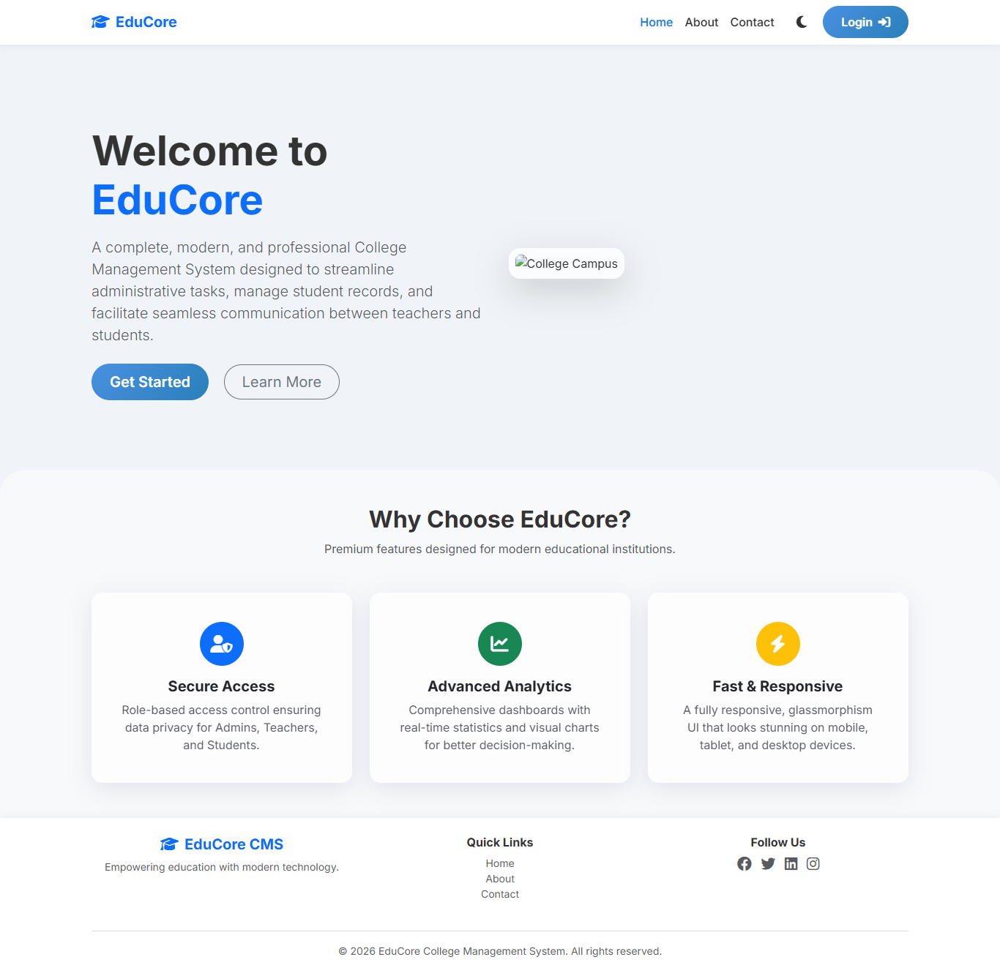
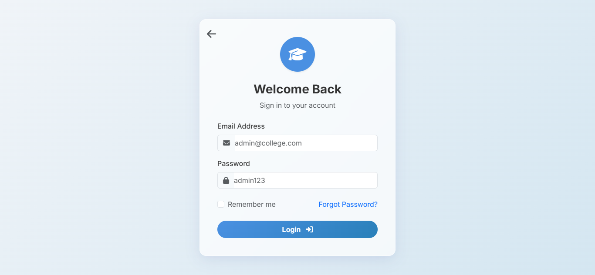
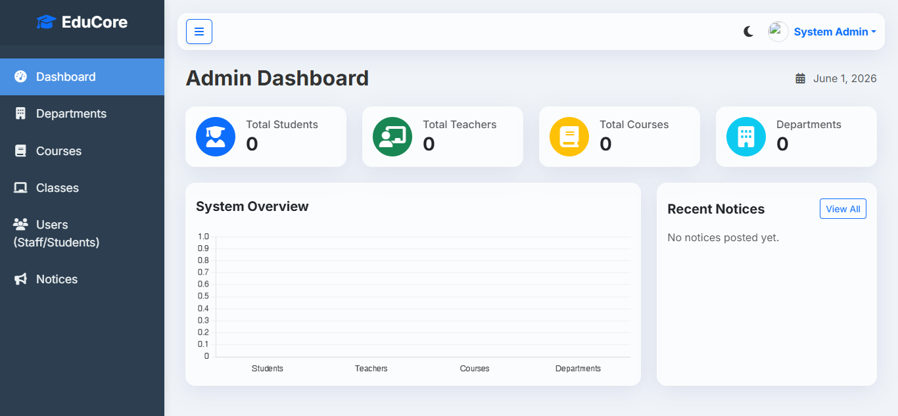
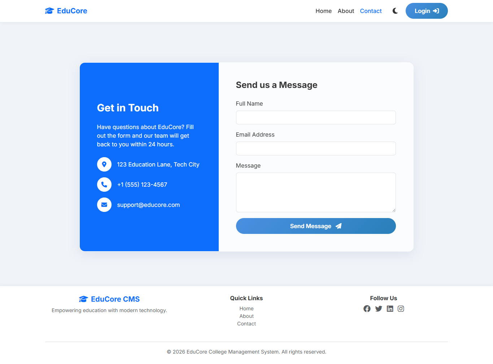
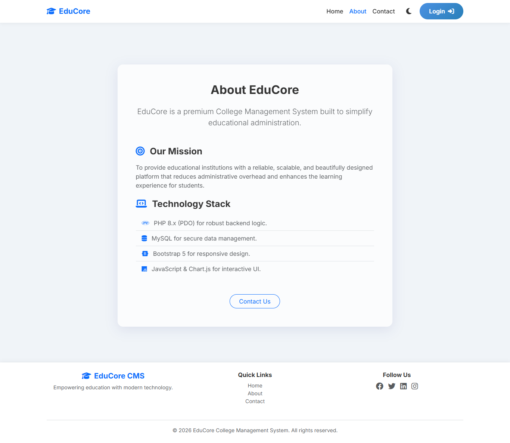

# 🎓 College Management System

A fully functional College Management System developed using PHP, MySQL, JavaScript, HTML, CSS, and Bootstrap. This system is designed to manage students, teachers, courses, attendance, fees, results, and administrative operations in an efficient and organized way.

---

## 🚀 Features

### 👨‍💼 Admin Panel
- Secure admin login system
- Manage students (Add / Edit / Delete)
- Manage teachers
- Manage courses and departments
- Manage notices and announcements
- View system dashboard
- User management system

### 👨‍🎓 Student Panel
- Student login system
- View profile information
- Check attendance records
- View exam results
- View fee details
- View notices

### 👨‍🏫 Teacher Panel
- Teacher login system
- Manage attendance
- Manage classes
- Enter student results
- View assigned courses

---

## 🛠️ Technologies Used

- PHP (Backend)
- MySQL (Database)
- JavaScript (Frontend logic)
- HTML5
- CSS3
- Bootstrap (Responsive UI)

---

## 📂 Project Modules

- Admin Module
- Student Module
- Teacher Module
- Authentication System
- Attendance Management System
- Results Management System
- Fee Management System
- Notice Board System

---

## 📸 Screenshots

### 🏠 Home Page

### 🔐 Login Page

### 📊 Admin Dashboard

### 📢 Contact Page

### 👨‍🎓 About Page

---

## ⚙️ Installation Guide

1. Download or clone this repository:

git clone https://github.com/hariskhan-136/college-management-system.git

2. Import database file:

/database/college_management_system.sql

3. Configure database connection:

/includes/config.php

4. Run project on local server (XAMPP/WAMP):

http://localhost/college-management-system/

---

## 🌐 Live Demo

👉 https://harisvoting.infinityfreeapp.com/college-management-system/

---

## 📁 Project Structure

/admin → Admin panel files
/student → Student panel files
/teacher → Teacher panel files
/includes → Config, header, footer, functions
/assets → CSS, JS, images
/database → SQL database file
/screenshots → Project screenshots

---

## 👨‍💻 Developer Info

- Student Project (BS Computer Science)
- Full Stack Web Development Project
- Focus: Role-based management system using PHP & MySQL

---

## 📌 Note

This project is developed for learning and portfolio purposes. It demonstrates:
- Role-based authentication
- CRUD operations
- Database integration
- Modular PHP architecture

---

⭐ If you like this project, don't forget to give it a star on GitHub!
